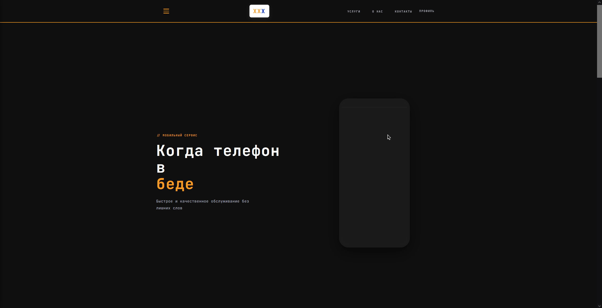
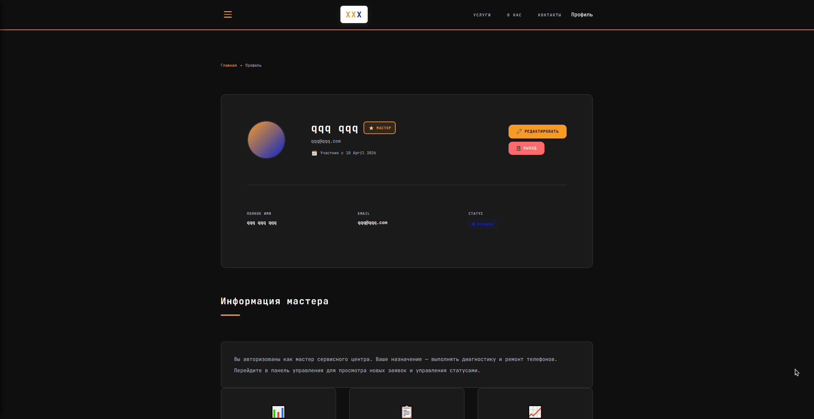
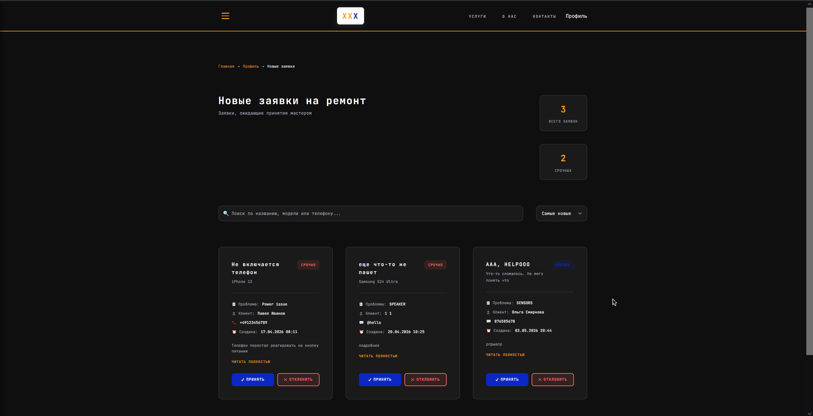
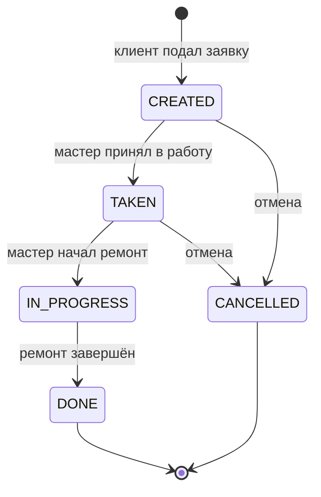
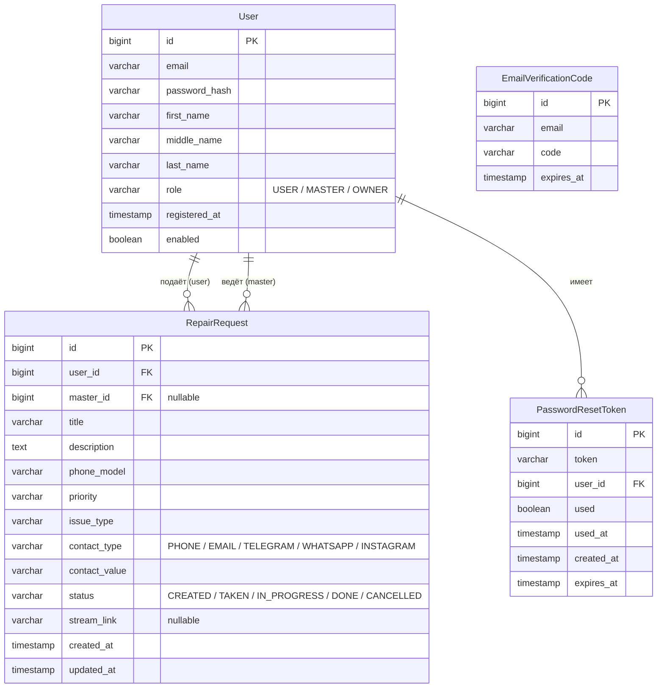

# XyXarXpert (читается как «ХухарЭксперт»)

Веб-приложение сервисного центра по ремонту мобильных телефонов:
приём заявок, распределение между мастерами, уведомления по email.


## Скриншоты

| Главная                               | Личный кабинет                           | Заявки мастера                               |
|---------------------------------------|------------------------------------------|----------------------------------------------|
|  |  |  |

## Возможности

### Аккаунты и безопасность
- Регистрация с подтверждением email — 6-значный код, TTL 10 минут
- Вход с редиректом по роли (кастомный `CustomSuccessHandler`)
- Восстановление пароля по одноразовой ссылке — UUID-токен, TTL 15 минут, повторное использование запрещено
- Смена пароля из личного кабинета (с проверкой текущего)
- Редактирование профиля (ФИО)
- Подтверждение email можно отключить флагом `app.email-verification=false`

### Заявки на ремонт
- Создание заявки: модель телефона, тип неисправности, описание, приоритет
- Контакт для связи на выбор: `PHONE`, `EMAIL`, `TELEGRAM`, `WHATSAPP`, `INSTAGRAM` (whitelist-валидация на сервере)
- Очередь заявок для персонала: сначала высокий приоритет, затем по дате; счётчик срочных заявок
- Привязка мастера к заявке, смена статусов через REST-эндпоинты
- Ссылка на live-трансляцию ремонта: клиент получает её на почту, когда мастер начинает ремонт

### Email-уведомления
| Событие | Что приходит |
|---|---|
| Регистрация | Код подтверждения почты |
| Подтверждение почты | Поздравление |
| Запрос сброса пароля | Ссылка с токеном (15 мин) |
| Мастер принял заявку | Уведомление с данными мастера |
| Ремонт начался | Ссылка на трансляцию ремонта |

## Роли и права

| Действие | USER (клиент) | MASTER | OWNER |
|---|:---:|:---:|:---:|
| Регистрация, вход, восстановление пароля | ✔ | ✔ | ✔ |
| Создание заявки на ремонт | ✔ | — | — |
| Просмотр своих заявок и статусов | ✔ | ✔ | ✔ |
| Просмотр общей очереди заявок | — | ✔ | ✔ |
| Приём заявки в работу | — | ✔ | ✔ |
| Старт ремонта (со ссылкой на стрим) | — | ✔ | ✔ |
| Завершение / отмена заявки | — | ✔ | ✔ |
| Управление аккаунтом | ✔ | ✔ | ✔ |

## Жизненный цикл заявки



Приоритетная сортировка очереди: `HIGH`-приоритет и статус `CREATED` — первыми,
далее остальные `CREATED` по дате подачи.

## Стек

| Слой | Технология |
|---|---|
| Backend | Java 17, Spring Boot 4.0 |
| Безопасность | Spring Security (BCrypt, CSRF, роли) |
| Доступ к данным | Spring Data JPA / Hibernate |
| БД | PostgreSQL |
| Шаблоны | Thymeleaf + thymeleaf-extras-springsecurity6 |
| Почта | Spring Mail (SMTP) |
| Фронтенд | Ванильный CSS/JS, без сборщиков |
| Прочее | Lombok, Maven Wrapper, Spring DevTools |

## Архитектура

```mermaid
flowchart TD

subgraph group_web["Web interface"]
node_auth_controller["Authentication"]
node_main_controller["Home page"]
node_user_controller["Profile pages"]
node_repair_controller["Repair endpoints"]
node_templates["Server-rendered pages"]
end

subgraph group_accounts["Accounts and security"]
node_user_service["Account operations<br/>[UserService.java]"]
node_user_details["Login user lookup"]
node_security_config["Access rules"]
node_success_handler["Login redirect"]
node_security_util["Current user<br/>[SecurityUtil.java]"]
end

subgraph group_repair["Repair workflow"]
node_repair_service["Request lifecycle"]
end

subgraph group_data["Persistence and messaging"]
node_repair_repo[("Repair requests")]
node_user_repo[("User records")]
node_verification_repo[("Verification codes")]
node_reset_repo[("Reset tokens")]
node_email_service["Email notifications<br/>[EmailService.java]"]
end

node_visitor(("Visitor or user"))
node_repair_staff(("Repair staff"))
node_mail_provider["Mail server"]

node_visitor -->|"register or recover"| node_auth_controller
node_visitor -->|"visit home"| node_main_controller
node_visitor -->|"manage profile"| node_user_controller
node_visitor -->|"submit request"| node_repair_controller
node_repair_staff -->|"view requests"| node_user_controller
node_repair_staff -->|"change status"| node_repair_controller
node_main_controller -->|"renders"| node_templates
node_auth_controller -->|"renders"| node_templates
node_user_controller -->|"renders"| node_templates
node_user_controller -->|"gets request lists"| node_repair_service
node_user_controller -->|"gets assigned requests"| node_repair_repo
node_user_controller -->|"updates account"| node_user_service
node_user_controller -->|"gets current user"| node_security_util
node_auth_controller -->|"registers or resets"| node_user_service
node_auth_controller -->|"verifies email"| node_email_service
node_auth_controller -->|"looks up token"| node_reset_repo
node_repair_controller -->|"runs lifecycle actions"| node_repair_service
node_repair_controller -->|"notifies request owner"| node_email_service
node_repair_controller -->|"finds request owner"| node_user_service
node_repair_service -->|"gets current user"| node_security_util
node_repair_service -->|"reads and saves requests"| node_repair_repo
node_repair_service -->|"looks up master"| node_user_repo
node_repair_service -->|"sends start notice"| node_email_service
node_user_service -->|"reads and saves users"| node_user_repo
node_user_service -->|"looks up request owner"| node_repair_repo
node_user_service -->|"saves verification code"| node_verification_repo
node_user_service -->|"saves or reads token"| node_reset_repo
node_user_service -->|"sends account email"| node_email_service
node_user_details -->|"loads by email"| node_user_repo
node_email_service -->|"reads verification code"| node_verification_repo
node_email_service -->|"enables verified user"| node_user_repo
node_email_service -->|"sends mail"| node_mail_provider
node_security_config -->|"loads login identity"| node_user_details
node_security_config -->|"uses login handler"| node_success_handler

click node_auth_controller "https://github.com/pavlent1yy/XyXarXpert/blob/main/src/main/java/com/xxxpert/xyxarxpert/controllers/AuthController.java"
click node_main_controller "https://github.com/pavlent1yy/XyXarXpert/blob/main/src/main/java/com/xxxpert/xyxarxpert/controllers/MainController.java"
click node_user_controller "https://github.com/pavlent1yy/XyXarXpert/blob/main/src/main/java/com/xxxpert/xyxarxpert/controllers/UserController.java"
click node_repair_controller "https://github.com/pavlent1yy/XyXarXpert/blob/main/src/main/java/com/xxxpert/xyxarxpert/controllers/RepairRequestController.java"
click node_templates "https://github.com/pavlent1yy/XyXarXpert/tree/main/src/main/resources/templates"
click node_user_service "https://github.com/pavlent1yy/XyXarXpert/blob/main/src/main/java/com/xxxpert/xyxarxpert/services/UserService.java"
click node_user_details "https://github.com/pavlent1yy/XyXarXpert/blob/main/src/main/java/com/xxxpert/xyxarxpert/services/UserDetailsServiceImpl.java"
click node_security_config "https://github.com/pavlent1yy/XyXarXpert/blob/main/src/main/java/com/xxxpert/xyxarxpert/config/SecurityConfig.java"
click node_success_handler "https://github.com/pavlent1yy/XyXarXpert/blob/main/src/main/java/com/xxxpert/xyxarxpert/CustomSuccessHandler.java"
click node_security_util "https://github.com/pavlent1yy/XyXarXpert/blob/main/src/main/java/com/xxxpert/xyxarxpert/services/SecurityUtil.java"
click node_repair_service "https://github.com/pavlent1yy/XyXarXpert/blob/main/src/main/java/com/xxxpert/xyxarxpert/services/RepairRequestService.java"
click node_repair_repo "https://github.com/pavlent1yy/XyXarXpert/blob/main/src/main/java/com/xxxpert/xyxarxpert/repositories/RepairRequestRepository.java"
click node_user_repo "https://github.com/pavlent1yy/XyXarXpert/blob/main/src/main/java/com/xxxpert/xyxarxpert/repositories/UserRepository.java"
click node_verification_repo "https://github.com/pavlent1yy/XyXarXpert/blob/main/src/main/java/com/xxxpert/xyxarxpert/repositories/VerificationRepository.java"
click node_reset_repo "https://github.com/pavlent1yy/XyXarXpert/blob/main/src/main/java/com/xxxpert/xyxarxpert/repositories/PasswordResetTokenRepository.java"
click node_email_service "https://github.com/pavlent1yy/XyXarXpert/blob/main/src/main/java/com/xxxpert/xyxarxpert/services/EmailService.java"

classDef toneBlue fill:#dbeafe,stroke:#2563eb,stroke-width:1.5px,color:#172554
classDef toneAmber fill:#fef3c7,stroke:#d97706,stroke-width:1.5px,color:#78350f
classDef toneMint fill:#dcfce7,stroke:#16a34a,stroke-width:1.5px,color:#14532d
classDef toneRose fill:#ffe4e6,stroke:#e11d48,stroke-width:1.5px,color:#881337
classDef toneIndigo fill:#e0e7ff,stroke:#4f46e5,stroke-width:1.5px,color:#312e81
class node_auth_controller,node_main_controller,node_user_controller,node_repair_controller,node_templates,node_visitor toneBlue
class node_user_service,node_user_details,node_security_config,node_success_handler,node_security_util toneAmber
class node_repair_service,node_mail_provider toneMint
class node_repair_repo,node_user_repo,node_verification_repo,node_reset_repo,node_email_service toneRose
class node_repair_staff toneIndigo
```



## Модель данных



Схема создаётся автоматически (`spring.jpa.hibernate.ddl-auto=update`) — для курсового
проекта этого достаточно; в проде заменил бы на Flyway-миграции.

## HTTP API

### Страницы (Thymeleaf)
| Метод | Путь | Доступ | Описание |
|---|---|---|---|
| GET | `/` | все | Главная |
| GET/POST | `/auth/register` | все | Регистрация |
| GET/POST | `/auth/verify` | все | Подтверждение email |
| GET/POST | `/auth/login` | все | Вход |
| GET/POST | `/auth/forgot-password` | все | Запрос сброса пароля |
| GET/POST | `/auth/reset-password` | все | Сброс пароля по токену |
| GET | `/profile` | авторизованные | Личный кабинет |
| GET | `/profile/all-requests` | OWNER, MASTER | Очередь заявок |
| GET | `/profile/my-requests` | OWNER, MASTER | Заявки мастера |
| GET/POST | `/profile/change-password` | авторизованные | Смена пароля |
| POST | `/logout` | авторизованные | Выход |

### REST-эндпоинты заявок
| Метод | Путь | Доступ | Описание |
|---|---|---|---|
| POST | `/repair-request` | USER | Создать заявку |
| POST | `/api/repair-request/{id}/accept` | MASTER, OWNER | Принять в работу |
| POST | `/api/repair-request/{id}/start-repair` | MASTER, OWNER | Начать ремонт (тело: `{"liveStreamUrl": "..."}`) |
| POST | `/api/repair-request/{id}/complete` | MASTER, OWNER | Завершить |
| POST | `/api/repair-request/{id}/cancel` | MASTER, OWNER | Отменить |

## Запуск

### Требования
- JDK 17+
- Docker (для PostgreSQL) или локальный PostgreSQL

### 1. Поднимите PostgreSQL

```yaml
# docker-compose.yml
services:
  postgres:
    image: postgres:16-alpine
    container_name: xyxarxpert-db
    environment:
      POSTGRES_DB: xxxpert
      POSTGRES_USER: postgres
      POSTGRES_PASSWORD: postgres
    ports:
      - "5433:5432"
    volumes:
      - pgdata:/var/lib/postgresql/data

volumes:
  pgdata:
```

```bash
docker compose up -d
```

### 2. Задайте переменные окружения

| Переменная | Описание |
|---|---|
| `DB_USERNAME` | Пользователь БД |
| `DB_PASSWORD` | Пароль БД |
| `EMAIL_USERNAME` | SMTP-логин (например, Gmail-адрес) |
| `EMAIL_PASSWORD` | SMTP-пароль / app-password |

Либо положите их в `src/main/resources/private-info.properties`
(файл в `.gitignore`, подхватывается через `spring.config.import`).

### 3. Запустите приложение

```bash
./mvnw spring-boot:run
```

Откройте http://localhost:1212

### Тестовые роли

После регистрации выдайте роль напрямую в БД:

```sql
UPDATE "User" SET role = 'OWNER' WHERE email = 'you@example.com';
-- или 'MASTER'
```

## Структура проекта

```
src/main/java/com/xxxpert/xyxarxpert/
├── XyXarXpertApplication.java      # точка входа
├── CustomSuccessHandler.java       # редирект после логина по роли
├── RepairRequestStatus.java        # enum статусов заявки
├── config/
│   └── SecurityConfig.java         # правила доступа, BCrypt, логаут
├── controllers/
│   ├── AuthController.java         # регистрация, верификация, сброс пароля
│   ├── MainController.java         # главная
│   ├── RepairRequestController.java# REST заявок
│   └── UserController.java         # профиль, очереди заявок
├── entities/                       # JPA-сущности и DTO
├── repositories/                   # Spring Data репозитории
└── services/
    ├── UserService.java            # аккаунты, токены, коды
    ├── EmailService.java           # отправка писем
    ├── RepairRequestService.java   # жизненный цикл заявок
    ├── SecurityUtil.java           # текущий пользователь
    └── UserDetailsServiceImpl.java # загрузка юзера для Security

src/main/resources/
├── application.properties
├── static/css/                     # base / components / pages / sections / utilities
├── static/js/
└── templates/                      # Thymeleaf + фрагменты (header, footer, profile/*)
```

## Безопасность

- Пароли хранятся только в виде BCrypt-хешей
- Секреты (БД, SMTP) — через переменные окружения, не в репозитории
- CSRF-защита включена; сессия инвалидируется при логауте
- Коды верификации и reset-токены одноразовые, с TTL
- Whitelist-валидация типов контактов и серверная валидация заявок
- Ролевой доступ на уровне URL (`SecurityConfig`) и методов (`@PreAuthorize`)

## Тестирование

```bash
./mvnw test
```
